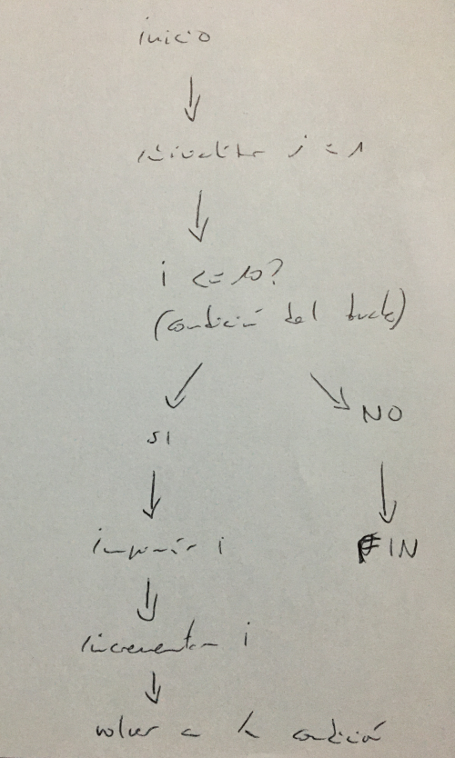
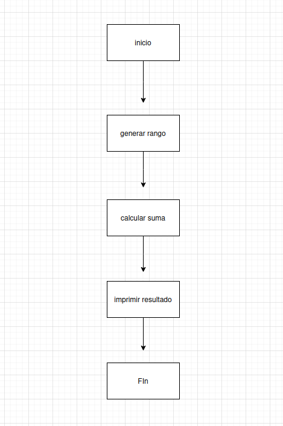
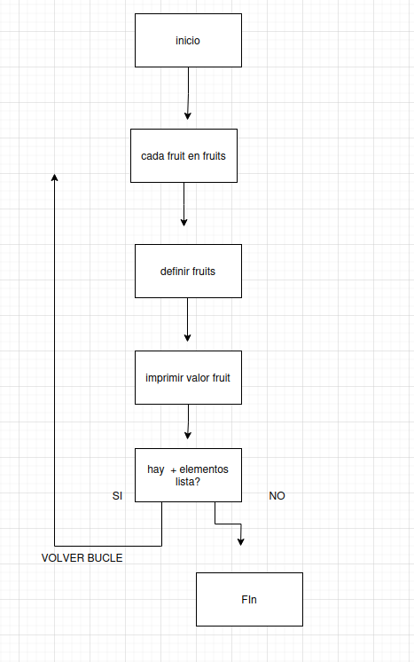
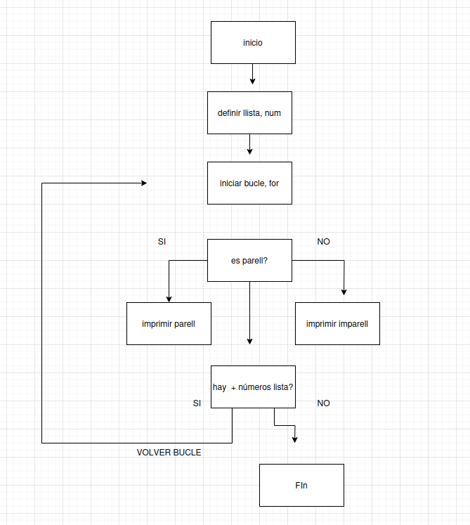
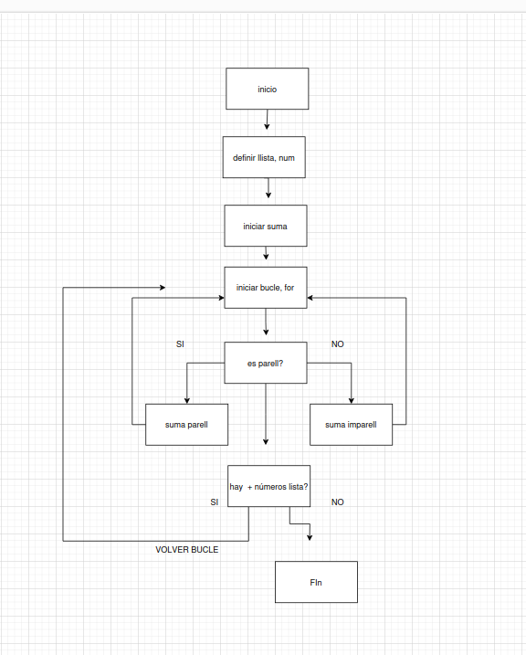
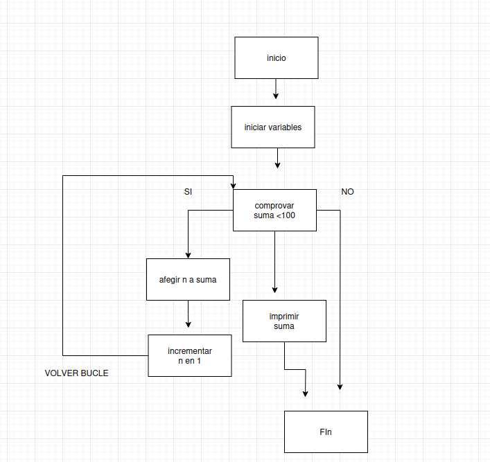
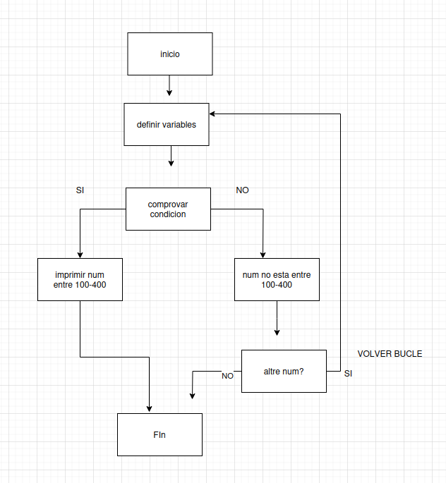

# SGE_B_PYTHON

##Activitat3

###diagrama de flujo for y while

###diagrama de flujo sumar primers 10 num utilitzan for i range()

###diagrama de flujo imprimir elements llista amb for

###diagrama de flujo imprimir nums parells i imparells d'una llista amb for

###diagrama de flujo suma nums parells i suma nums imparells

###diagrama de flujo sumar nums fins arribar a 100 amb while

###diagrama de flujo num guardat entre 100 i 400 amb while

